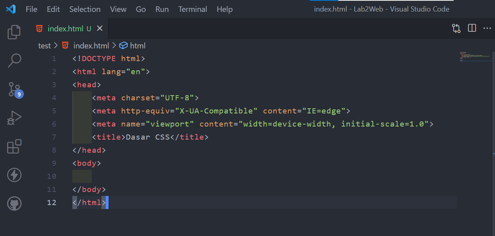
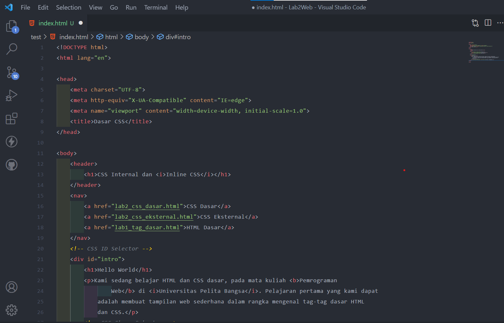
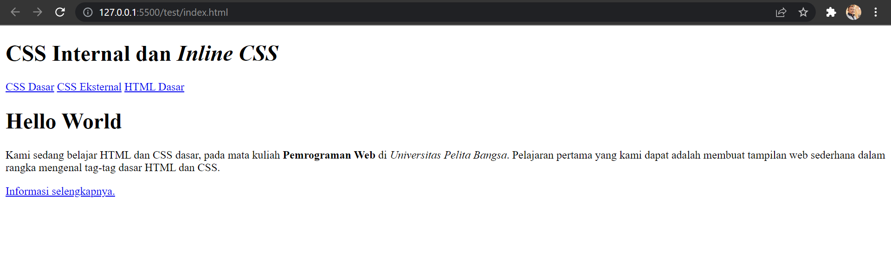
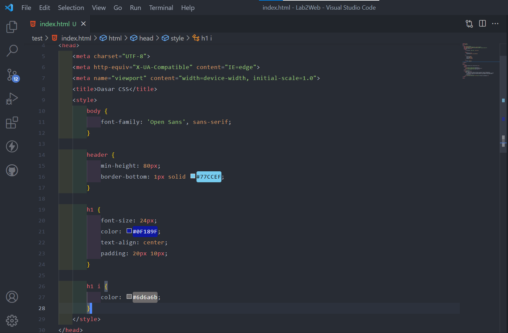
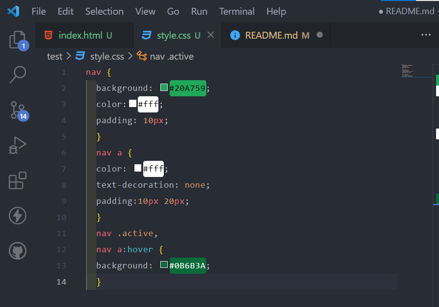
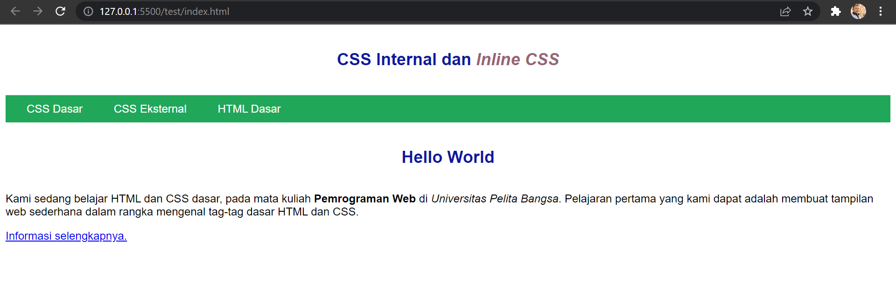
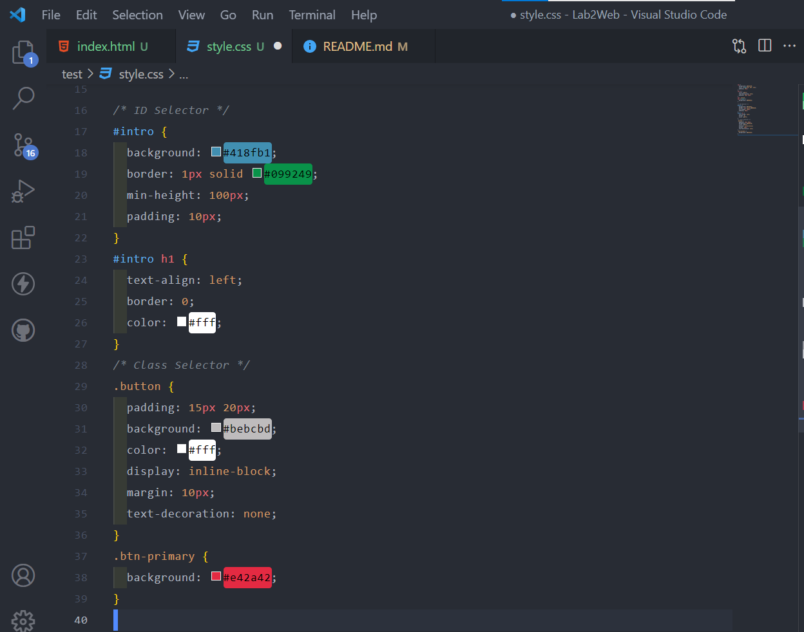
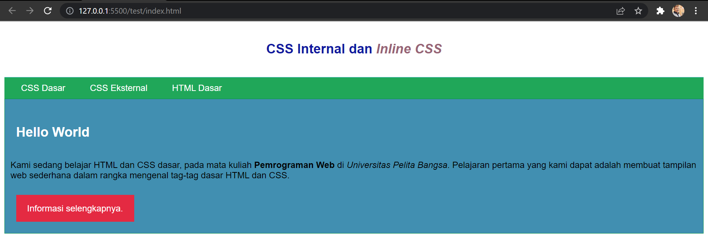
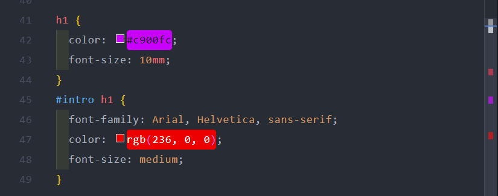
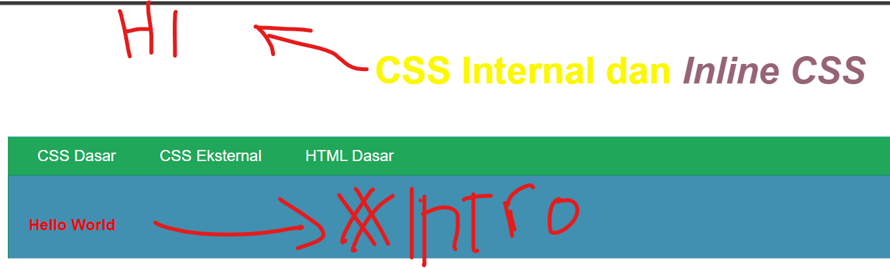

# LANGKAH LANGKAH PRAKTIKUM 2

## 1. Membuat Dokumen HTML



## 2. Mendeklarasikan Dokumen Html


Simpan perubahan untuk melihat hasil pada browser


## 3. Menambahkan Inline Pada CSS



## 4. Membuat CSS Eksternal


Kemudian tambahkan tag `<link>` untuk merujuk file css yang sudah dibuat pada bagian `<head>`

```html
<head>
  <!-- menyisipkan css eksternal -->
  <link rel="stylesheet" href="style_eksternal.css" type="text/css" />
</head>
```

simpan untuk melihat perubahan pada browser


## 5. Menambahkan CSS Selector


simpan untuk melihat perubahan pada
<hr>

## Pertanyaan Tugas

1. Lakukan eksperimen dengan mengubah dan menambah properti dan nilai pada kode CSS
   dengan mengacu pada CSS Cheat Sheet yang diberikan pada file terpisah dari modul ini.
2. Apa perbedaan pendeklarasian CSS elemen h1 {...} dengan #intro h1 {...}? berikan
   penjelasannya!
3. Apabila ada deklarasi CSS secara internal, lalu ditambahkan CSS eksternal dan inline CSS pada
   elemen yang sama. Deklarasi manakah yang akan ditampilkan pada browser? Berikan
   penjelasan dan contohnya!
4. Pada sebuah elemen HTML terdapat ID dan Class, apabila masing-masing selector tersebut
   terdapat deklarasi CSS, maka deklarasi manakah yang akan ditampilkan pada browser?
   Berikan penjelasan dan contohnya!  (`<p id="paragraf-1" class="text-paragraf">`)<p>
## Jawaban
1. Saya akan mengubah dan menambahkan pada kode CSS.

Simpan untuk memngubah perubahan

2. h1{} Untuk memberikan style pada semua element h1.<br>
* #intro h1{} Awalan simbol hash (#) memungkinkan kita untuk memberi style pada id. selector id bersifat kaku dan tidak bisa digunakan kembali pada element yang lainnya.
 <br>

3. Setelah dilakukan pengujian, deklarasi CSS Inline lebih dahulu tampil di browser, itu dikarenakan permintaan HTTP yang sangat kecil memungkinkan untuk ditampilkan dahulu.
4. Deklarasi id="paragraf-1" akan ditampilkan pada browser, karena selektor id lebih spesifik dari class atau bahkan element P itu sendiri, kecuali jika kita menambahkan property pada inline element P maka selektor id tersebut akan tertimpa, karena inline lebih spesifik daripada id, class, dan element